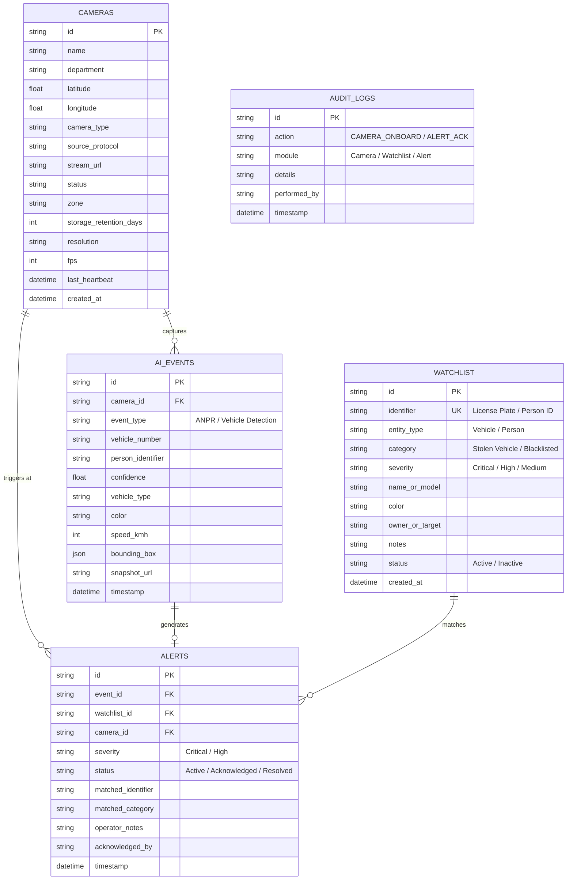
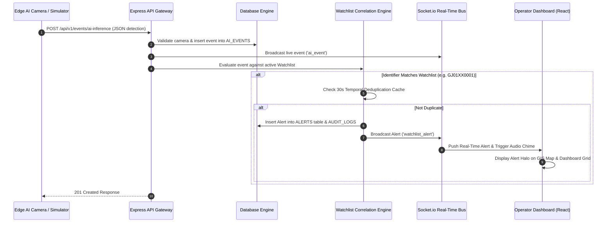

# okDriver Smart CCTV Monitoring, Video Analytics & Real-Time Alert Platform
## Technical Architecture & 80,000 Camera Distributed System Specification

*Aligned with Gujarat Police Innovation Hackathon 2026 Problem Statement*

---

## 1. Executive Summary
The **okDriver CCTV Platform** is a scalable enterprise video intelligence solution connecting heterogeneous CCTV infrastructure, edge AI analytics, target watchlist correlation, real-time alert dispatching, and GIS vehicle route reconstruction.

---

## 2. Core System Architecture

```
┌──────────────────────────────────────────────────────────────────────────────────┐
│                         PRESENTATION LAYER (React + Vite + Leaflet)              │
│  - Unified Monitoring Dashboard with Canvas AI Stream Overlays                   │
│  - GIS Movement Map & Chronological Route Reconstruction Timeline                │
│  - Camera Registry & Audit Trail                                                 │
│  - Real-Time Alert Desk with Audio Chime & Operator Acknowledge/Resolve          │
└────────────────────────────────────────▲─────────────────────────────────────────┘
                                         │ WebSockets (Socket.io) & REST API
┌────────────────────────────────────────▼─────────────────────────────────────────┐
│                          APPLICATION & REAL-TIME BUS (Node.js)                   │
│  ├── REST API Gateway (`/api/v1`)                                                │
│  ├── Interactive Swagger / OpenAPI Specification (`/api-docs`)                   │
│  ├── Real-time Push Event Bus (Socket.io Server)                                 │
│  ├── Watchlist Matching & Temporal Deduplication Engine                          │
│  └── Synthetic AI Inference Engine & Camera Heartbeat Daemon                     │
└────────────────────────────────────────▲─────────────────────────────────────────┘
                                         │ Transactional Storage
┌────────────────────────────────────────▼─────────────────────────────────────────┐
│                          DATABASE & PERSISTENCE TIER                             │
│  - Cameras (ID, Name, Dept, Lat/Lng, Protocol, Status, Heartbeat, Zone)          │
│  - Watchlist (Identifier, Category, Severity, Target Details, Status)            │
│  - AI Events (CameraID, Vehicle Number, Speed, BBox, Confidence, Timestamp)      │
│  - Alerts (EventID, WatchlistID, Severity, Status, Operator Notes, AckBy)        │
│  - Audit Logs (Action, Module, PerformedBy, IP, Timestamp)                       │
└──────────────────────────────────────────────────────────────────────────────────┘
```

### Database Entity-Relationship (ER) Diagram



### Real-Time Watchlist Correlation Sequence Diagram



---

## 3. Key Technical Subsystems

### A. Camera Registry & Onboarding
- **Heterogeneous Protocol Support**: Accepts RTSP, ONVIF, HLS, WebRTC, and Edge Simulator URIs.
- **Health Monitoring**: Continuous 15-second heartbeat ping daemon tracking `Online`, `Degraded`, and `Offline` states.
- **Audit Logging**: All camera additions, metadata updates, and status toggles produce immutable audit log records.

### B. AI Video Analytics Integration
- **Ingestion API**: `POST /api/v1/events/ai-inference` accepts JSON inference results from edge gateways or computer vision models.
- **Supported Analytics**: ANPR (License Plate Recognition), Vehicle Type Classification, Speeding Violation, Person Detection.

### C. Watchlist Matching & Deduplication Engine
- **Instant Correlation**: incoming license plates or person IDs are matched in $O(1)$ against active target watchlist items.
- **Temporal Deduplication**: Suppresses duplicate alerts for the same entity at the same camera within a 30-second window.
- **Real-Time Push**: Emits `watchlist_alert` socket payload instantly to connected operators.

### D. GIS & Chronological Vehicle Movement Tracing
- **Route Reconstruction**: Given a target plate (e.g. `GJ01XX0001`), fetches all historical detections across cameras ordered by timestamp.
- **Spatial Analytics**: Computes segment distances via Haversine formula, travel time in minutes, estimated speed between checkpoints, and renders an animated polyline route on Leaflet.

---

## 4. 80,000 Camera Scalability & Production Blueprint

### A. Distributed Compute Hierarchy
1. **Edge Tier (80,000 Cameras)**:
   - Industrial AI Gateways (e.g. NVIDIA Jetson Orin / L4 Edge Appliances) installed at junctions.
   - Local AI inference extracts ANPR JSON metadata; raw video remains at edge.
   - **Bandwidth Savings**: 99.8% reduction in network traffic (only 2 KB JSON payload per event vs 4 Mbps video stream).
2. **Regional Tier (Districts)**:
   - Apache Kafka Event Bus clusters deployed at District Police Head Quarters.
   - Local HLS/WebRTC transcoding relays for live feed requests.
3. **Central Cloud Tier**:
   - Central State Command Hub hosting ClickHouse / TimescaleDB sharded database clusters.

### B. Storage Sizing & Tiering
- **Hot Tier (0-30 Days)**: NVMe SSD storage for instant lookup & GIS tracing.
- **Warm Tier (31-365 Days)**: Object Storage (AWS S3 / MinIO) for metadata & event snapshots.
- **Cold Tier (> 1 Year)**: Tape / AWS Glacier Deep Archive for long-term evidentiary compliance.

### C. GPU Infrastructure Sizing
- Model: NVIDIA L4 Tensor Core GPU (24GB VRAM).
- Capacity: 1 GPU handles 40 1080p 30fps video analytics streams.
- Total GPU Cluster required for 80,000 streams = **2,000 NVIDIA L4 GPUs**.

### D. Disaster Recovery & High Availability
- Multi-region Active-Active deployment with automated failover.
- Regional edge nodes cache up to 72 hours of detection events locally if central connectivity fails.

---

## 5. Security & Compliance
- **Authentication & RBAC**: Role-based access control (Admin, Duty Inspector, Operator).
- **Network Isolation**: IP-MPLS VPN tunnels between CCTV edge networks and central VMS.
- **Stream URL Protection**: Short-lived HMAC signed tokens for WebRTC/RTSP stream playback.
